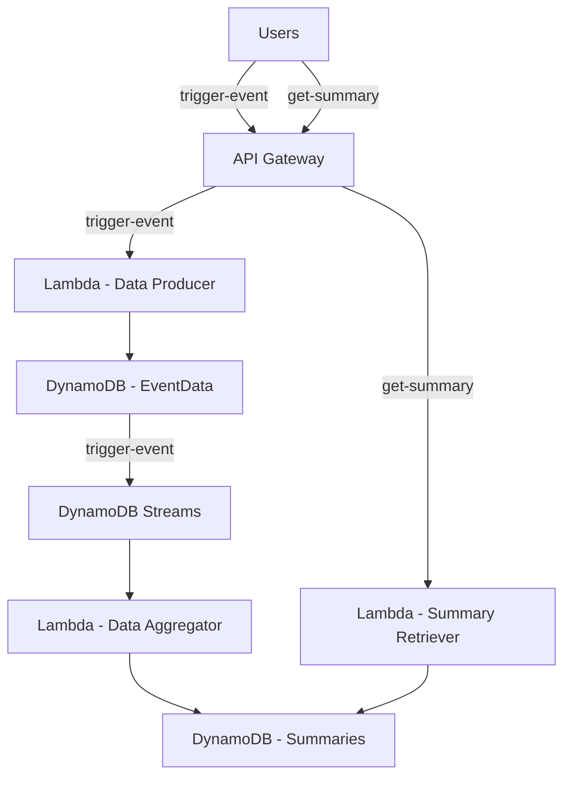
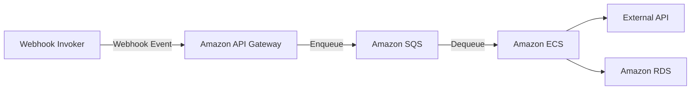
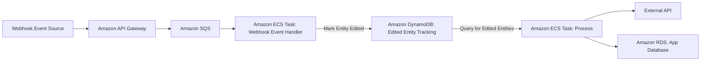

# AWS Odyssey

- [AWS Odyssey](#aws-odyssey)
  - [Set Up](#set-up)
  - [ec2-ssh](#ec2-ssh)
    - [Creating EC2 instances and SSH'ing to them](#creating-ec2-instances-and-sshing-to-them)
  - [ec2-access-recovery](#ec2-access-recovery)
  - [event-aggregator](#event-aggregator)
    - [Deployment Diagram](#deployment-diagram)
    - [Create Data Producer API](#create-data-producer-api)
    - [Create Data Aggregator Flow](#create-data-aggregator-flow)
    - [Run it!](#run-it)
  - [webhook-event-handler](#webhook-event-handler)
    - [Deployment Diagram](#deployment-diagram-1)
    - [Steps](#steps)
  - [webhook-debounce-handler](#webhook-debounce-handler)
    - [Deployment Diagram](#deployment-diagram-2)
    - [Design Note](#design-note)
    - [Steps](#steps-1)


## Set Up
1. Set up a new AWS account. For example, `abc-aws-odyssey`
1. Set your AWS profile in `.env`
1. Run `source ./set-aws-account.sh`
1. Verify the Account ID is what you expect.
1. Set up IAM Identity Center to enable SSO-based AWS CLI access. 
    * Note: Had to use AWS Organization path as the single account path did not offer Permission Sets, which is needed for giving users/groups access to an account. No documentation sugggested that will be a problem (not even Q Assistant), had to trial and error. 
1. Add an Admin group, give them Admin access.
1. Add a new User, put them in the Admin group.
1. Set up AWS CLI access via `aws configure sso`
    * You will need the "start" SSO URL that can be found under IAM Identity Center - Settings
1. Install or update `terraform`
1. Generate a Key Pair for configuring EC2 instances with `generate-key-pair.sh`


## ec2-ssh
### Creating EC2 instances and SSH'ing to them
1. Set up an initial `main.tf` to make basic calls and prove out terraform access to the AWS account.
1. Add VPC creation to `main.tf`.
1. Add a Public Subnet.
    * Command for veryfying Subnet: 
    ```aws ec2 describe-subnets --filters "Name=vpc-id,Values=$(terraform output -raw vpc_id)" --query "Subnets[?Tags[?Value=='terraform-public-subnet']].SubnetId"```
1. Add a Private Subnet.
1. Add an Internet Gateway.
1. Add an EC2 instance.
1. Add a Route for SSH to EC2
1. SSH to the EC2 instance, e.g. `ssh -i aws-odyssey-key-pair.pem ec2-user@[IP ADDRESS]`

## ec2-access-recovery
Instructions for recoverying access to an EC2 instance if the original Key Pair is lost. 

[See the README](ec2-access-recovery/README.md)

## event-aggregator
Create an API triggered data flow that aggregates data via event streaming

### Deployment Diagram


### Create Data Producer API
1. Add Dynamo tables
1. Create Data Producer Lamba function python code
1. Zip via script
1. Use source hash code to ensure terraform recognizes the resource has changed when the python code is changed
1. Set up API gateway and all the connectivty bits to invoke the Lambda
1. Invoke Lambda via `trigger-event.sh` script that calls the API Gateway `trigger-event` POST method
    * Observe event data written to DynamoDb Event Data table

Challenges that came up:
* We did some resource rename refactors and it appears not all of them stuck. Specifically the API Gateway was trying to call the Lambda's old URI. 

### Create Data Aggregator Flow
1. Create Event Data DynamoDb Stream
1. Create the Event Aggregator Lambda
1. Create Lambda Event Source Mapping to trigger the Event Aggregator Lambda from the Event Data DynamoDb Stream

### Run it!
Execute `trigger-events.sh` to test out single events. 

To verify Items are appearing in the Summary table, run:
```sh
aws dynamodb scan --table-name event-aggregator-summaries --output json
```

Example output:
```json
{
    "Items": [
        {
            "ItemCount": {
                "N": "131"
            },
            "SummaryID": {
                "S": "{\"message\": \"Test event data\", \"value\": 3}"
            }
        },
        {
            "ItemCount": {
                "N": "129"
            },
            "SummaryID": {
                "S": "{\"message\": \"Test event data\", \"value\": 9}"
            }
        },
        {
            ...
        }
    ]
}
```

To generate _a lot_ of data, run `trigger-multiple-events.sh`. Feel free to experiment with different batch sizes and durations.


## webhook-event-handler

Handle inbound webhook events in a way that supports handling a high volume of events without bottlenecking when processing the events. An architeectural goal is to decouple receiving events from processing events to ensure we can record all events that are sent to us and avoid situations where our processing may not be able to keep up if we attempt to process all events as soon as they are recieved.

To do this, a Webhook API will be recieve Events and enqueue them. An ECS task will subscribe to the queue and process events as they arrive. 

BONUS: Set up auto-scaling to scale out the ECS Task should the Queue size grow too large. 

### Deployment Diagram


### Steps
1. Set up an API Gateway endpoint to receive the webhook events
2. Test out the API Gateway Endpoint
   1. Set up CloudWatch logging to troubleshoot it 🙃
   1. Be aware of stale stage deployments
3. Add permissions for API Gateway to integrate with SQS 
4. Create the API Gateway to SQS Integration
    1. Big gotcha - using EOF for the `request-templates` result in leading spaces and breaking the request to SQS. 
1. Create ECR and push a Python SQS consumer image
1. Create ECS Task that uses Python SQS consumer image to consume from SQS
1. Set up all the other ECS bits (VPC, cluster, task, service) to kick off a task!
    1. Gotchas pop up around task role that has access to SQS queue, and making sure the task has public internet access to pull from ECR
1. _ToDo_: Finish this experiment by connecting the Task to RDS and simulate calling an external API. The goal to demonstrate the Webhook API can get hammered, and work will simply queue up until the task consumes it. Bonus: auto-scaling if single task cannot keep up (can add sleeps on the API call to simiulate delays)

## webhook-debounce-handler
A webhook event signals when an entitiy in another system has changed. Events can happen for many small changes happening close together. The event does not contain state, we have to request state. To minimize expensive calls to request state, debouncing will be used to only attempt a state request when change events have stopped for a period of time.

### Deployment Diagram


### Design Note
Track an Entity change event time, and a last processed time. For all entities that have last processed and change event times older than 1 minute, process them. Update last processed time. Can also consider deleting the entity change tracking record after processing to avoid needing to manage last processed time. If a change record exists, it needs to be procssed, just wait until it hasn't changed in 1 minute.  

### Steps
1. Build off of `webhook-event-handler`
2. 