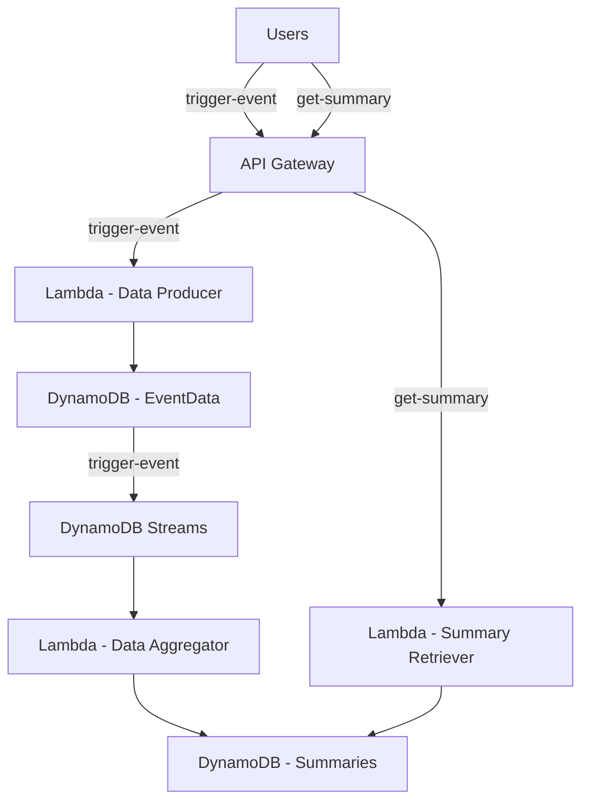

# AWS Odyssey

## Set Up
1. Set up a new AWS account. For example, `abc-aws-odyssey`
1. Set your AWS profile in `.env`
1. Run `source ./set-aws-account.sh`
1. Verify the Account ID is what you expect.
1. Set up IAM Identity Center to enable SSO-based AWS CLI access. 
    * Note: Had to use AWS Organization path as the single account path did not offer Permission Sets, which is needed for giving users/groups access to an account. No documentation sugggested that will be a problem (not even Q Assistant), had to trial and error. 
1. Add an Admin group, give them Admin access.
1. Add a new User, put them in the Admin group.
1. Set up AWS CLI access via `aws configure sso`
    * You will need the "start" SSO URL that can be found under IAM Identity Center - Settings
1. Install or update `terraform`
1. Generate a Key Pair for configuring EC2 instances with `generate-key-pair.sh`


## ec2-ssh
### Creating EC2 instances and SSH'ing to them
1. Set up an initial `main.tf` to make basic calls and prove out terraform access to the AWS account.
1. Add VPC creation to `main.tf`.
1. Add a Public Subnet.
    * Command for veryfying Subnet: 
    ```aws ec2 describe-subnets --filters "Name=vpc-id,Values=$(terraform output -raw vpc_id)" --query "Subnets[?Tags[?Value=='terraform-public-subnet']].SubnetId"```
1. Add a Private Subnet.
1. Add an Internet Gateway.
1. Add an EC2 instance.
1. Add a Route for SSH to EC2
1. SSH to the EC2 instance, e.g. `ssh -i aws-odyssey-key-pair.pem ec2-user@[IP ADDRESS]`

## event-aggregator
### Create an API triggered data flow that aggregates data via event streaming

#### Create Data Producer API
1. Add Dynamo tables
1. Create Data Producer Lamba function python code
1. Zip via script
1. Use source hash code to ensure terraform recognizes the resource has changed when the python code is changed
1. Set up API gateway and all the connectivty bits to invoke the Lambda
1. Invoke Lambda via `trigger-event.sh` script that calls the API Gateway `trigger-event` POST method
    * Observe event data written to DynamoDb Event Data table

Challenges that came up:
* We did some resource rename refactors and it appears not all of them stuck. Specifically the API Gateway was trying to call the Lambda's old URI. 

#### Create Data Aggregator Flow
1. Create Event Data DynamoDb Stream
1. Create the Event Aggregator Lambda
1. Create Lambda Event Source Mapping to trigger the Event Aggregator Lambda from the Event Data DynamoDb Stream

#### Run it!
Execute `trigger-events.sh` to test out single events. 

To verify Items are appearing in the Summary table, run:
```sh
aws dynamodb scan --table-name event-aggregator-summaries --output json
```

Example output:
```json
{
    "Items": [
        {
            "ItemCount": {
                "N": "131"
            },
            "SummaryID": {
                "S": "{\"message\": \"Test event data\", \"value\": 3}"
            }
        },
        {
            "ItemCount": {
                "N": "129"
            },
            "SummaryID": {
                "S": "{\"message\": \"Test event data\", \"value\": 9}"
            }
        },
        {
            ...
        }
    ]
}
```

To generate _a lot_ of data, run `trigger-multiple-events.sh`. Feel free to experiment with different batch sizes and durations.


### Deployment Diagram
