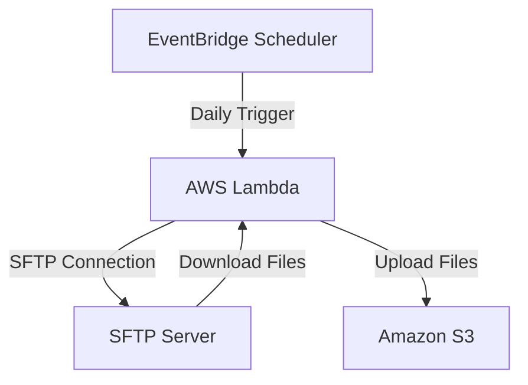

# SFTP to S3 Backup Tool

Automated solution for backing up SFTP server contents to AWS S3. Uses AWS Lambda for the backup process and EventBridge Scheduler for automated daily backups.

## Deployment Diagram


## Components
- **AWS Lambda Function**: Connects to SFTP server, downloads files, and uploads them to S3
- **EventBridge Scheduler**: Triggers the Lambda function daily at 5 AM UTC (midnight EST)
- **S3 Bucket**: Stores the backup files with versioning enabled
- **Secrets Manager**: Securely stores SFTP credentials

## Setup
1. Create a `.env` file in the `cdk` directory with the following variables:
   ```
   SFTP_HOST=your-sftp-host
   SFTP_USERNAME=your-username
   SFTP_PASSWORD=your-password
   SFTP_PORT=22
   S3_BUCKET_NAME=your-bucket-name
   ```

2. Set up Python virtual environment and install dependencies:
   ```sh
   cd sftp-s3-backup-tool/cdk
   python -m venv .venv
   source .venv/bin/activate
   pip install -r requirements.txt
   ```

3. Deploy the stack:
   ```sh
   cdk deploy
   ```

## Testing
To test the Lambda function directly (without waiting for the schedule):
```sh
./test_lambda.sh
```

## Monitoring
- Check CloudWatch Logs for Lambda function execution details
- Monitor the S3 bucket for new backup files
- View EventBridge Scheduler execution history in AWS Console

## Architecture Details
- Lambda function runs on Python 3.11 runtime
- SFTP credentials stored securely in AWS Secrets Manager
- S3 bucket configured with versioning for backup history
- Daily backups scheduled via EventBridge Scheduler
- IAM roles and policies configured for least privilege access

## Troubleshooting
1. Check CloudWatch Logs for Lambda execution errors
2. Verify SFTP credentials in Secrets Manager
3. Ensure Lambda has proper IAM permissions for S3 and Secrets Manager
4. Confirm EventBridge Scheduler is active and configured correctly 