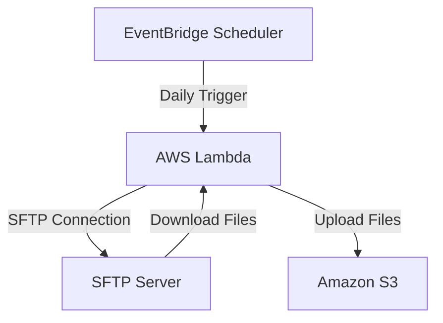

# SFTP to S3 Backup Tool

Automated solution for backing up SFTP server contents to AWS S3. Uses AWS Lambda for the backup process and EventBridge Scheduler for automated daily backups.

## Deployment Diagram


## Components
- **AWS Lambda Function**: Connects to SFTP server, downloads files, and uploads them to S3
- **EventBridge Scheduler**: Triggers the Lambda function daily at 5 AM UTC (midnight EST)
- **S3 Bucket**: Stores the backup files with versioning enabled
- **Secrets Manager**: Securely stores SFTP credentials

## Setup
1. Create a `.env` file in the root directory with the following variables:
   ```
   # AWS Secrets Manager Secret Name
   SECRET_NAME=your-secret-name
   
   # Remote SFTP Path (Update based on your use case)
   REMOTE_PATH=/path/to/backup
   
   # Local Backup File Path
   LOCAL_BACKUP_PATH=/tmp/backup.tar.gz
   
   # S3 Bucket Name for Storage
   S3_BUCKET=your-bucket-name
   ```

2. Store SFTP credentials in AWS Secrets Manager:
   ```sh
   # Edit set-up-sftp-secrets.sh first to update:
   # - secret name (should match SECRET_NAME in .env)
   # - SFTP_HOST (including port if not 22)
   # - SFTP_USER
   # - SFTP_PASSWORD
   ./set-up-sftp-secrets.sh
   ```
   This script will create a secret in AWS Secrets Manager with your SFTP connection details. The Lambda function will retrieve these credentials at runtime.

3. Set up Python virtual environment and install dependencies:
   ```sh
   cd sftp-s3-backup-tool/cdk
   python -m venv .venv
   source .venv/bin/activate
   pip install -r requirements.txt
   ```

4. Deploy the stack:
   ```sh
   cdk deploy
   ```

## Testing
To test the Lambda function directly (without waiting for the schedule):
```sh
./test_lambda.sh
```

## Monitoring
- Check CloudWatch Logs for Lambda function execution details
- Monitor the S3 bucket for new backup files
- View EventBridge Scheduler execution history in AWS Console

## Verifying Nightly Backups
1. Check CloudWatch Logs:
   ```sh
   # Get the log group name from the Lambda function
   aws logs tail /aws/lambda/SftpBackupStack-BackupFunction --since 24h
   ```
   This will show logs from the last 24 hours, including any errors or successful backups.

2. Check S3 for new backups:
   ```sh
   # List the most recent backups (replace with your bucket name)
   aws s3 ls s3://your-bucket-name/ --recursive --human-readable --summarize
   ```

3. Check EventBridge Scheduler execution history in AWS Console:
   - Go to EventBridge Scheduler
   - Find the schedule named in stack outputs (e.g., `SftpBackupStack-DailyBackupSchedule-XXXXX`)
   - View the "Invocation History" tab

Each successful backup should:
- Create a new file in S3
- Show "SUCCESS" in CloudWatch logs
- Have a successful invocation in EventBridge history

## Architecture Details
- Lambda function runs on Python 3.11 runtime
- SFTP credentials stored securely in AWS Secrets Manager
- S3 bucket configured with versioning for backup history
- Daily backups scheduled via EventBridge Scheduler
- IAM roles and policies configured for least privilege access

## Troubleshooting
1. Check CloudWatch Logs for Lambda execution errors
2. Verify SFTP credentials in Secrets Manager
3. Ensure Lambda has proper IAM permissions for S3 and Secrets Manager
4. Confirm EventBridge Scheduler is active and configured correctly 